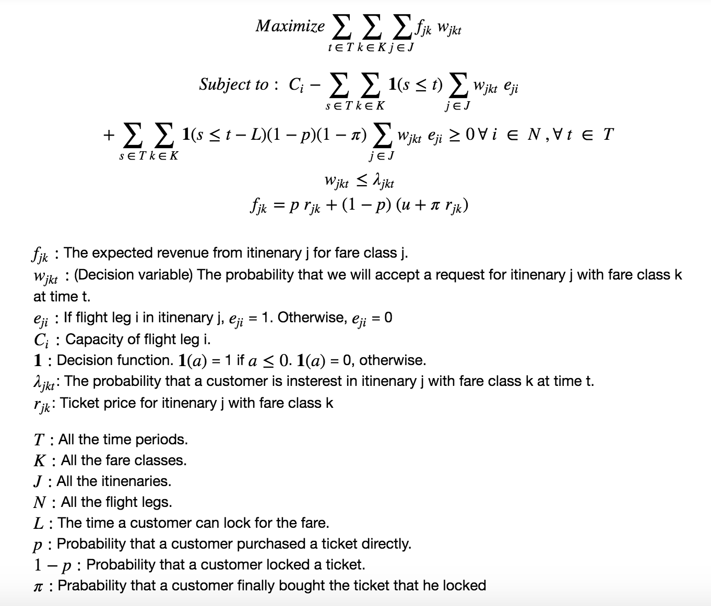

# Network Revenue Management with Fare Locking (in working)

## Description

This project is building a linear program to find the optimal policy in order to maximize the total network revenue. 
The linear program also considered the fare locking options so the customer can lock the fare for a certain time interval. 

### Prerequisites

You need to install following libraries in python in order to run the project:  
networkx  
gurobi  

## Linear Program Formulation 

## Project Process
* Airline Network Simulation
* Network Dataset Construction and Simulation
* Solving the Linear Program

